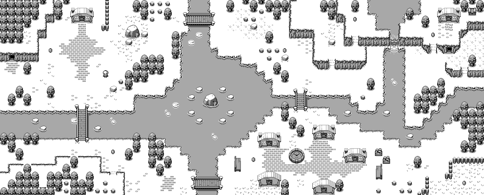

#



## 👋 ¡Hola! Soy Daniel Lescano

Me gusta crear cosas que funcionen bien y se vean bien. Trabajo con React, Node, Python y lo que haga falta para resolver el problema. A lo largo de los años pasé por muchas etapas: sitios estáticos, APIs complejas, apps médicas, inmobiliarias, internas... Hoy busco proyectos que me reten técnicamente y donde pueda seguir creciendo.

```js
const techStack = {
  languages: ["JavaScript", "TypeScript", "Python"],
  frontend: ["React", "Next.js", "Vue.js", "Bootstrap", "HTML", "CSS"],
  backend: ["Node.js", "Express", "GraphQL", "Django REST"],
  databases: ["PostgreSQL", "MySQL", "MongoDB", "sqlite3"],
  tools: ["Git", "Docker", "GitLab", "Jira", "Miro"],
};
```

📫 **Contacto**  
📧 d.lescano.129@gmail.com  
🔗 [linkedin.com/in/daniellescano129](https://linkedin.com/in/daniellescano129)  
🐙 [github.com/dlescano400](https://github.com/dlescano400)
